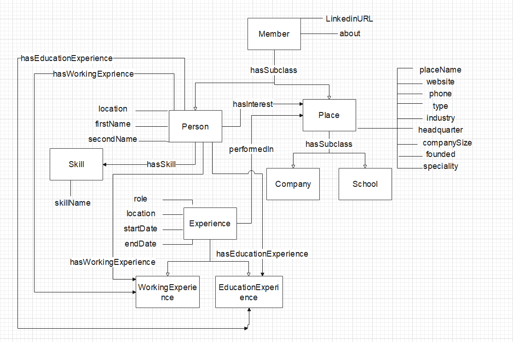

# Linkedin Web Scraping: creating a ontology for Sematic Web 
## Authors: Lorenzo Mandelli
#### Università degli Studi di Firenze

---

The project allows to extract data from the __Linkedin__ application through a __Data Scraping__ phase and subsequently through them populate a structured __RDF graph__ starting from an ontology that summarizes the functional scheme of the famous working application.

To achieve this objective, the extracted data are converted into a structure compatible with an __Insert Query__ expressed in the __SPARQL__ language and are then inserted into the RDF model through the use of the [__TopBraidComposer__](https://www.topquadrant.com/products/topbraid-composer/ "TopBraidComposer") application which allows the operation.

The nature of this project is strictly academic and therefore the resulting RDF graph, also available at this [__Link__](http://lorenzomwebsite.altervista.org/DW/linkedin.owl "OWL file") as __.OWL__, is small in size. Despite this, it allows the use of SPARQL queries for statistical analysis purposes.

---

## Installation

This code was written in Python 3.8. The [__Selenium library__](https://www.selenium.dev/ "Selenium library") is required for the __Data Scraping__ phase and it can be obtained through *pip install selenium*.

## Usage

In order to run the program execute the file *main.py*. 
For the execution it is required that the google browser window used for the web scraping phase is not minimized for the entire duration of the application.

In order to provide login credentials to Linkedin for viewing profiles, the following account has been made available: email = *bryansevendeadlysins@outlook.com*, password = *Arthur123*.

In the event of a high number of accesses to the Linkedin account, it may be required to resolve a captcha in order to start the application correctly.

## Experiments

The graph is generated starting from a set of LinkedIn profiles resulting from a Google search for a specific category of worker that the software takes as input. To test the software it was decided to start the analysis from the first 10 resulting profiles of *python programmers* and living near *Florence* (Google search: *"site:linkedin.com/in/ AND "python developer" AND Firenze"*). 

## Limitations

Currently the software manages a conspicuous if limited number of entities present in the Linkedin application. The management of *Linkedin Groups, Posts, Videos* and *Jobs* will be implemented in future updates. The outline of the complete ontology is already available at this [Link](https://github.com/divanoLetto/LinkedinRDF/blob/main/images/DisegnoAdv.pdf "Schema avanzato").
